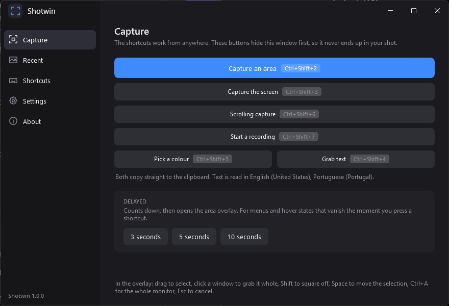

<p align="center">
  
</p>

<h1 align="center">Shotwin</h1>

<p align="center">
  <strong>A screenshot tool for Windows, built for pixel work.</strong><br>
  Capture, mark up, read the text out of an image, record a region to video, and keep a
  shot on top while you use it.
</p>

<p align="center">
  
</p>

<p align="center">
  
  
  
  
</p>

---

Windows ships two screenshot tools and neither is built for working at the pixel. Shotwin
is: a quiet overlay with no guide lines and no loupe in the way, a preview that lands
under the hand that drew the selection, and an editor whose tools are the ones actually
used on a screenshot.

.NET 10 and WPF over a SkiaSharp canvas. No Electron, no browser engine, and nothing to
install alongside it.

## Features

- **Capture** an area, a whole screen, or a scrolling page stitched into one image.
- **Annotate** with thirteen tools — arrows, boxes, blur, highlight, numbered steps,
  text — plus crop, cut and collage.
- **Read the text** out of any region, through the OCR built into Windows.
- **Pick a colour** with a 10x loupe as the pointer, in hex, RGB or HSL.
- **Record** a region to MP4, with a video editor that trims it into as many kept pieces
  as you like.
- **Pin** a shot on top of everything while you work from it.
- **Thirty languages**, following Windows or set by hand.
- **Self-updating**, per user, no installer and no admin rights.

## Install

Download `Shotwin.exe` from [Releases](../../releases) and run it.

## Shortcuts

| Shortcut | Action |
| --- | --- |
| `Ctrl+Shift+2` | Capture an area |
| `Ctrl+Shift+3` | Capture the screen |
| `Ctrl+Shift+4` | Grab text from a region |
| `Ctrl+Shift+5` | Pick a colour |
| `Ctrl+Shift+6` | Scrolling capture |
| `Ctrl+Shift+7` | Record the screen |

All six are rebindable on the **Shortcuts** page, and each has a command-line twin —
`Shotwin.exe --area`, `--screen`, `--text`, `--colour`, `--scrolling`, `--record` — so
they can be bound to a mouse button or a stream deck.

In the overlay: drag to select, click a window to take it whole, `Shift` for a square,
`Space` to move the selection mid-drag, `Ctrl+A` for the current monitor, `Esc` to
cancel.

## After a capture

The shot is saved, copied to the clipboard, and a preview thumbnail appears where the
drag finished — under the hand that just made it, not in a corner the eye has to go
looking for. Click it to edit, drag it into any app to drop the PNG, or use the row of
actions along the bottom.

Saving is a separate question: turn off *Save every capture* and a shot lives only on the
clipboard and in the preview until you press **Save**.

## Recording

`Ctrl+Shift+7` opens the same overlay. After a count-in, a red ring marks what is in shot
and a bar shows the elapsed time with **Stop** and **Cancel** — both hidden from screen
capture, so neither appears in the recording, and the ring passes clicks through.

Encoding is H.264 through the encoder built into Windows: no FFmpeg, hardware accelerated
where the machine has it, 15 to 120 frames a second. Video only, no audio.

Opening a recording from **Recent** opens the video editor. It plays through Windows' own
playback pipeline, at full resolution. The timeline shows the clip as blue pieces: drag
across empty track to keep another piece, drag a piece's ends or middle, click inside one
to put the playhead there. Playback jumps the gaps, so what you watch is what you get,
and **Save** writes the pieces to a new file joined end to end.

## Updates

Shotwin checks the latest release once at startup, in the background and silently. A
newer build turns the version at the foot of the left rail into **Update to 1.1.0**;
clicking it downloads the published `Shotwin.exe`, verifies it is really a program, swaps
it for the running one and restarts.

## Where things go

| What | Where |
| --- | --- |
| Shots and recordings | Chosen on first run; **Settings** to change it |
| Settings | `%APPDATA%\Shotwin\settings.json` |
| Crash log | `%APPDATA%\Shotwin\crash.log` |

Windows protects Pictures, Documents, Desktop and Videos from apps it does not know, so
Shotwin checks a folder is writable before using it and says so if it is not.

## Build

```powershell
.\install.ps1                      # or -StartWithWindows to run at login
```

Builds, publishes self-contained and single-file, and installs to
`%LOCALAPPDATA%\Programs\Shotwin` with a Start menu entry. `-Uninstall` removes all of
it. Needs the .NET 10 SDK.

| Script | Purpose |
| --- | --- |
| `install.ps1` | Build, publish and install |
| `tools/make-logo.ps1` | Render `docs/logo.png` from the app's own icon |
| `tools/make-screenshots.ps1` | Photograph the running app into `docs/` |

## How it works

- **Capture** is GDI `BitBlt` per monitor, with the DPI awareness to get physical pixels
  on a mixed-DPI desktop.
- **Scrolling capture** scrolls the window under the cursor and correlates row
  signatures to find the overlap, so it works on anything that scrolls rather than on a
  list of known apps.
- **Recording** paces frames to a wall clock and hands them to the Windows encoder as a
  `MediaStreamSource`; the strip and ring use `WDA_EXCLUDEFROMCAPTURE`.
- **The editor** draws on a SkiaSharp canvas and keeps every annotation as an object, so
  nothing is flattened until it is exported.

## Roadmap

- **QR reading** via ZXing.Net.
- **Colour picking beyond hex.** OKLCH, average colour, APCA/WCAG contrast.
- **Backdrop.** Gradients, shadows, rounded corners behind the shot.
- **Ruler / measure mode**, before-after GIF.
- **S3 upload.**
- **DXGI capture** for protected surfaces and lower latency.

## License

MIT
